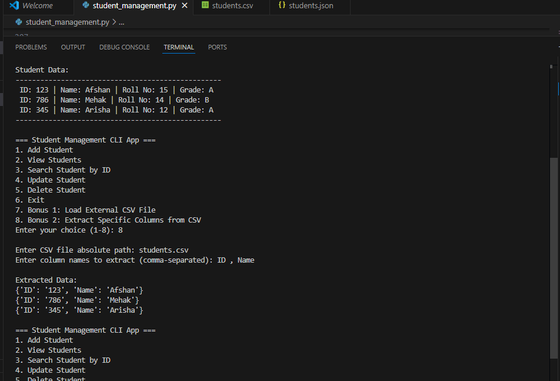

# 🎓 Student Management CLI App

A simple and interactive command-line application to manage student records using Python. The app supports adding, viewing, searching, updating, and deleting students, and stores data in both **JSON** and **CSV** formats.Features include reading external files and extracting specific columns from CSV files.

---

## 🚀 Features

- 📥 Add new students
- 📋 View all students
- 🔍 Search student by ID
- ✏️ Update student records
- 🗑️ Delete students
- 💾 Stores data in `students.json` and `students.csv`
- 📂 Load student data from CSV
- 📊 Extract and display selected columns from a CSV file

---

## 🛠️ Technologies Used

- Python 3
- JSON for structured data storage
- CSV for tabular data export

---

## ▶️ How to Run

1. **Clone the repository**

   git clone https://github.com/afshan-rasheed/Student-Management-CLI-App

2. **Run the App**

   python student_management.py

---

## 📸 Screenshot

Below is a screenshot of the CLI interface in action:

---

## 👤 Author

Project by: Afshan Rasheed Python CLI App: Student-Management-CLI App